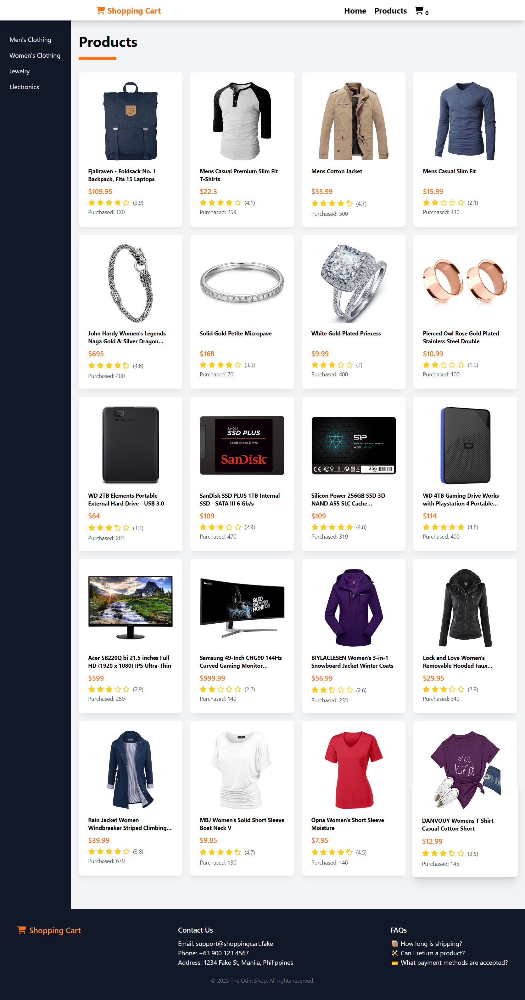

# Shopping Cart - Odin Project

A modern e-commerce shopping cart application built as part of The Odin Project curriculum. This project demonstrates a fully functional shopping experience with product listings, cart management, and a responsive design.

## 🔴 Live Demo
[View Live Demo](https://odinproject-shoppingcart.netlify.app/)

## 📸 Screenshots

### Homepage


### Products Page


## ✨ Features

- **Product Catalog**: Browse through various products with detailed information
- **Shopping Cart**: Add/remove items, update quantities, and view total
- **Star Ratings**: Visual rating system for products
- **Responsive Design**: Seamless experience across all device sizes
- **Modal Views**: Detailed product views with blur overlay effects
- **Category Filtering**: Filter products by different categories
- **Local Storage**: Persistent cart data across browser sessions

## 🛠️ Built With

- **React.js** - Frontend framework
- **Tailwind CSS** - Styling and responsive design
- **React Router** - Navigation and routing
- **Font Awesome** - Icons and star ratings
- **Vite** - Build tool and development server
- **JavaScript (ES6+)** - Programming language
- **HTML5** - Structure and semantics

## 📚 API

This project uses the [Fake Store API](https://fakestoreapi.com/) for product data, which provides:
- Product information
- Categories
- Ratings
- Prices

## 🎨 Design

- Homepage images generated using ChatGPT
- Modern and clean UI design
- Responsive layout for all screen sizes
- Intuitive user interface

## 🚀 Getting Started

### Prerequisites
- Node.js (v14 or higher)
- npm (Node Package Manager)

### Installation

1. Clone the repository
```bash
git clone [https://github.com/xxemat20xx/Shopping-cart.git]
```

2. Navigate to project directory
```bash
cd shopping-cart
```

3. Install dependencies
```bash
npm install
```

4. Start development server
```bash
npm run dev
```

5. Build for production
```bash
npm run build
```

## 📱 Usage

1. Browse products on the main page
2. Filter products by category using the sidebar
3. Click on products to view details
4. Add items to cart
5. Adjust quantities in cart
6. View total and proceed to checkout

## ✅ Testing

Run the test suite:
```bash
npm test
```

roject is open source and available under the [MIT License](LICENSE).

## 🙏 Acknowledgments

- [The Odin Project](https://www.theodinproject.com/)
- [Fake Store API](https://fakestoreapi.com/)
- [ChatGPT](https://chat.openai.com/) for image generation
- All the libraries and tools used in this project

⭐️ Star this repo if you like it!
